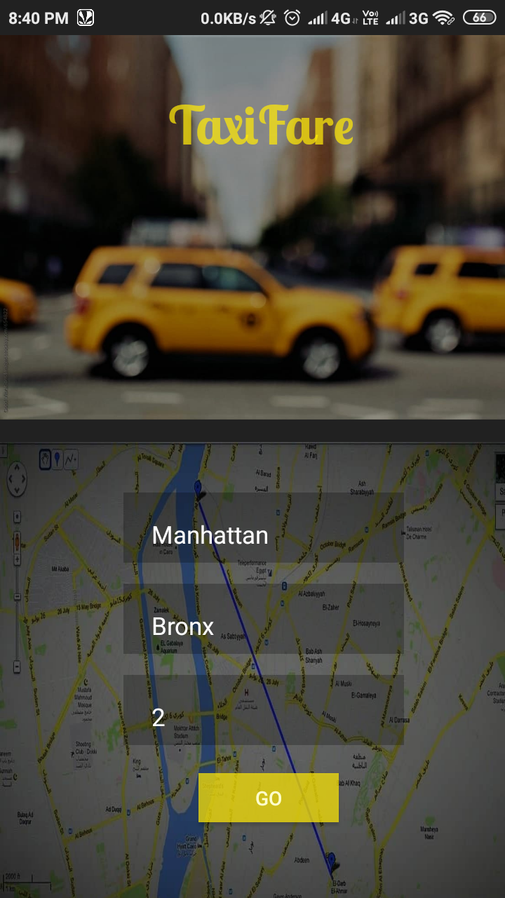
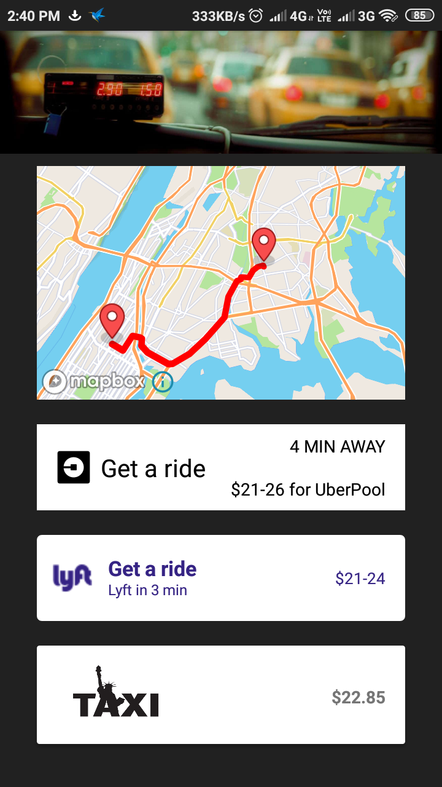
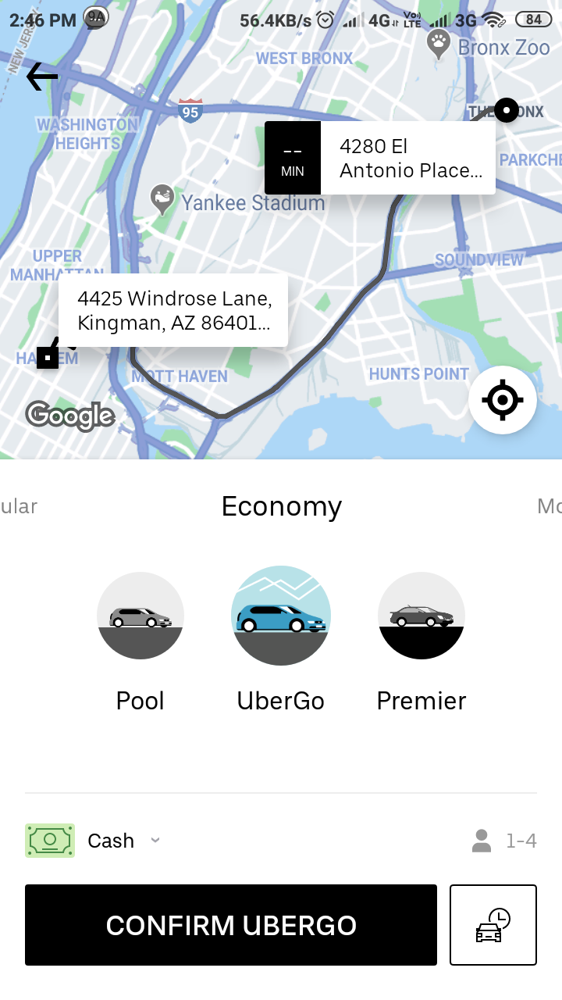
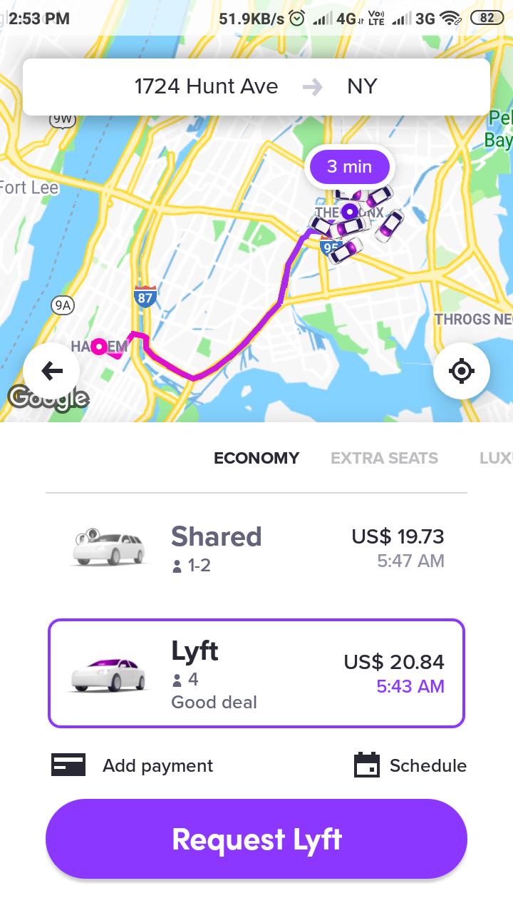
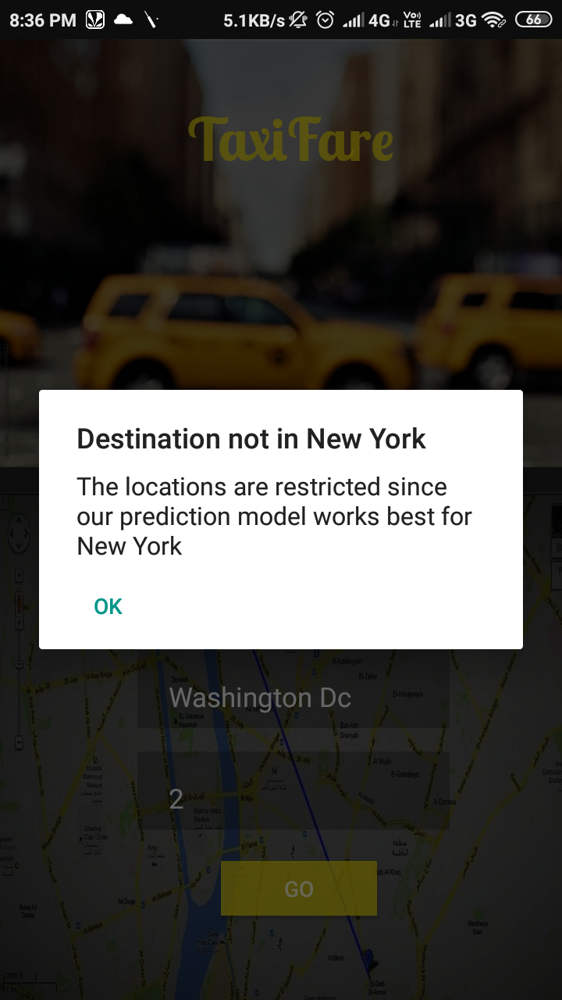
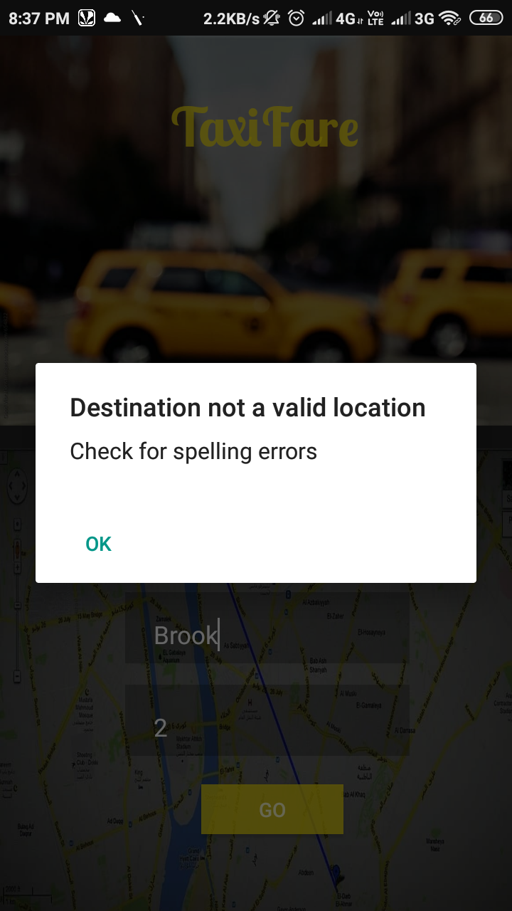
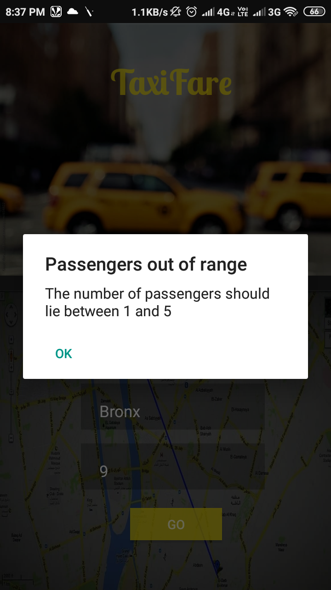

# TaxiFare
An app to predict the fare of NYC taxis and compare them with live fares of
Uber and Lyft taxi providers. It uses Neural Network trained on 50 million
taxi trips to predict the fare. It uses Uber API and Lyft API to provide live
fares and directly book a ride through Uber and Lyft apps and uses Mapbox
API to plot a map between source and destination. TaxiFare utilizes Django
framework to connect the Python training code and Android.

